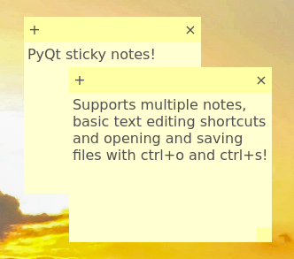

# PyQt Sticky Notes
A simple sticky notes program writen with Python and Qt 6.

The sticky notes always stick on top of other windows and support standard text editing keyboard shorcuts including undo, redo, save as and open.

